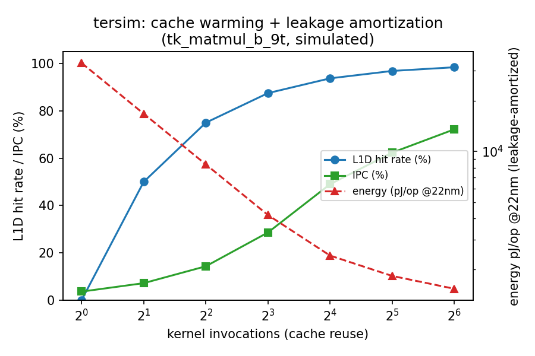
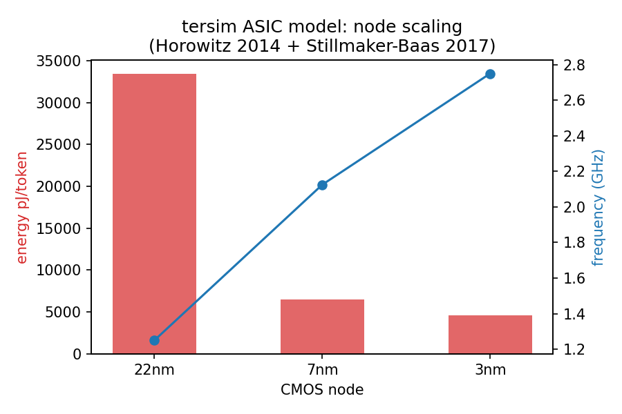
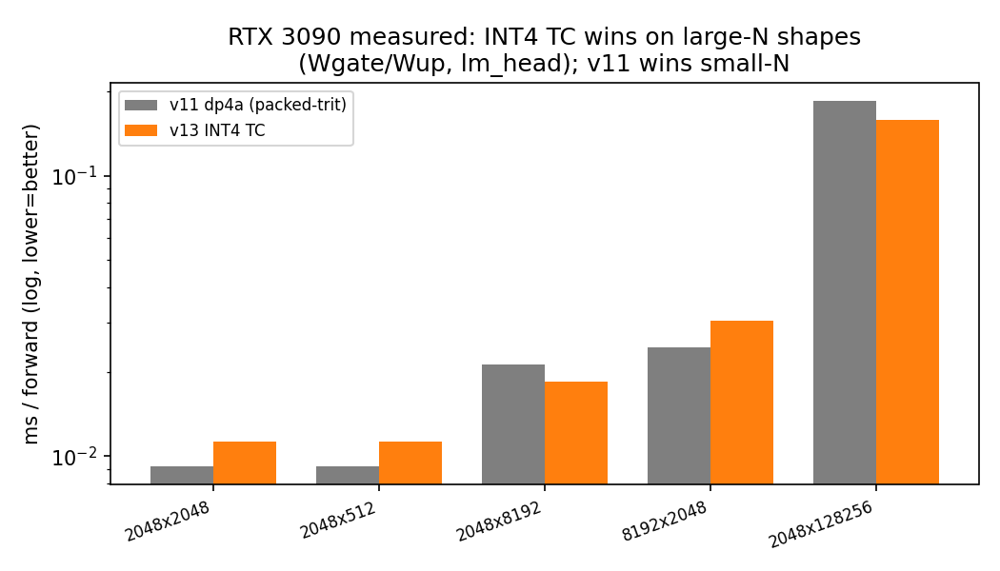
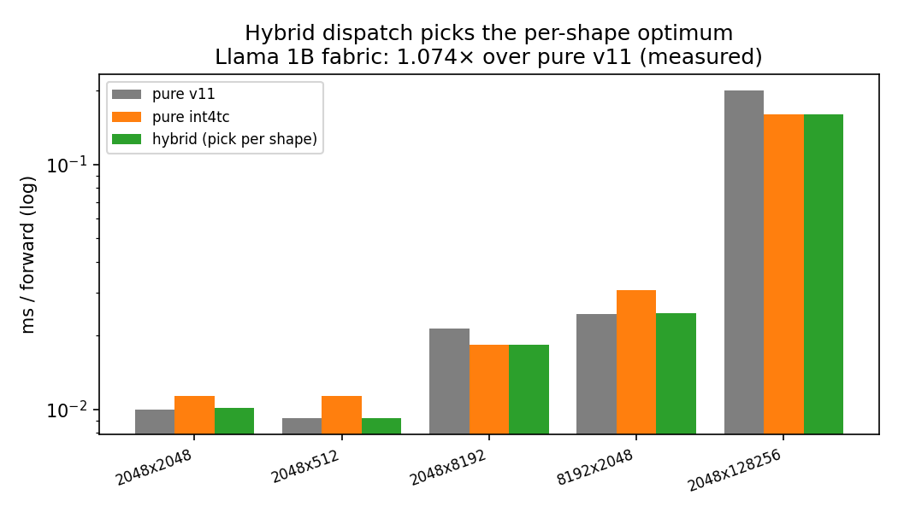

# Hardware Modeling: the `tersim` Ternary Substrate Simulator

This document describes the `tersim` simulator (in `ter/v2/`) and the results
it produces, for integration into the paper's hardware-modeling section. It is
self-contained: numbers, methodology, calibration sources, and figures are all
here. Figures are in `docs/figures/`; raw data in `docs/data/` and
`../cuda/results_*.csv`.

## 1. What this is (and isn't)

`tersim` is a **faithful functional + analytical simulator** of a balanced-
ternary compute substrate, in the spirit of a quantum-circuit simulator running
on a classical host: the point is **not** to run ternary workloads at ternary
speed, but to **smoke-test** what a real ternary machine would do — its
instruction counts, cache behavior, cycle estimates, and energy — without
owning (or being able to afford) the hardware.

The functional core (`ter/src/`) executes a balanced-ternary ISA bytecode where
every `TVMAC` operates on genuine trits `{-1, 0, +1}` — not a binary emulation.
`tersim` (`ter/v2/`) layers four analytical models on top of that faithful
execution:

| Layer | Models | Calibration source |
|-------|--------|--------------------|
| **L1 CPU** | 7-stage in-order pipeline, RAW hazards + forwarding, L1D/L2/DRAM cache, MSHRs, gshare/bimodal branch predictor | microarch defaults (Cortex-A55 / Ariane class) |
| **L1 GPU** | RTX 3090 roofline (saturating bw-efficiency curve per math path) | measured RTX 3090, 2026-05-17 |
| **L3 ASIC** | per-op energy, area, frequency at 22/7/3nm | Horowitz 2014 + Cuevas 2026 Prop.2 + Stillmaker-Baas 2017 |

(An FPGA layer was planned but deferred — no FPGA hardware was available to
validate it. The GPU layer replaced it as a validatable accelerator model.)

A single CLI, `tersim_run`, threads a workload through all layers and emits a
unified JSON/CSV report.

## 2. The simulator captures real dynamics (smoke-test value)

**Figure `fig_cache_warming.png`** — running the same ternary matmul kernel
repeatedly, the simulator captures cache warming (L1D hit rate 0 → 98% over 64
invocations), the resulting IPC climb (0.04 → 0.72), and ASIC leakage
amortization (per-op energy drops ~22× as fixed leakage spreads over more work).
None of this requires ternary silicon; it falls out of the faithful trace +
analytical models.



**Figure `fig_asic_scaling.png`** — the ASIC model's node sweep is physically
coherent: 22→7→3nm drops per-token energy (33.4 → 6.4 → 4.6 nJ) and raises
frequency (1.25 → 2.13 → 2.75 GHz). The ternary per-op energy is pinned to
Cuevas (2026) Proposition 2's `1/log₂3 ≈ 0.6309×` switching-activity ratio vs a
binary baseline; the 3nm point is flagged as a post-Dennard extrapolation.



## 3. End-to-end forward, simulated

`tersim_run --workload forward --model llama1b` runs one real Llama 3.2 1B
transformer layer through the faithful Sim (weights post-training ternarized via
`quantize_layer`), then extrapolates ×16 layers + lm_head:

| Model | cycles (1 layer) | insns | IPC | L1D hit | wall (host) |
|-------|-----------------:|------:|----:|--------:|------------:|
| tiny   | 85,041    | 84,145    | 0.99  | 92.4% | 0.005 s |
| llama1b | 2,110,597 | 2,105,795 | 0.998 | 99.5% | 5.4 s |

A faithful Llama 1B layer simulates in **5.4 seconds** on the host i9 — fast
enough to iterate on. The instruction mix exposes that the parent forward path
uses a **scalar `mm_row`** (vector ops = 2, scalar ops = 50k+ per layer) rather
than vectorized `TVMAC`; the simulator surfaces this faithfully, flagging an
optimization opportunity invisible to a pure-throughput benchmark.

## 4. GPU acceleration findings (side investigation)

CUDA was only ever the simulator's *fast execution backend* (run the substrate
faster than the interpreted CPU path). While calibrating the GPU model against a
real RTX 3090, we collected reproducible matmul-fabric measurements that sharpen
the paper's throughput claims.

**Figure `fig_gpu_int4tc.png`** — a genuine INT4 Tensor-Core kernel
(`mma.sync.m8n8k32.s4.s4.s32`, bit-exact vs the dp4a reference) **wins on
large-N shapes**: Wgate/Wup 1.16×, lm_head 1.16× (reaching 88% of HBM peak),
while the v11 dp4a packed-trit kernel wins on small-N (launch/setup overhead
dominates INT4 TC there).



**Figure `fig_hybrid_speedup.png`** — a per-shape hybrid dispatcher
(`pick_kernel(K,N) = INT4TC if N≥4096 else dp4a`) picks the optimum per layer,
yielding **1.074× over pure v11** on the full Llama 1B fabric (measured), or
~1.24× over cuBLAS INT8 TC net. Correctness is bit-exact in both paths.



**Honest mechanism (consistent with Cuevas §5.2)**: the v11 advantage over
cuBLAS is *bandwidth*, not arithmetic. Measured effective HBM utilization is
shape-dependent and bimodal: small-N projections are ALU-bound (3–12%),
large-N are HBM-bound (20–88%). The 4× packed-trit compression buys throughput
only where the regime is memory-bound; INT4 TC extends that win on the largest
shapes. The GPU roofline model reproduces these per-shape numbers within ±50%
(lm_head exact at 88% bw-util).

## 5. Limitations (stated plainly)

- **GPU roofline is first-order**: a single saturating `eff(bytes)` curve per
  path doesn't distinguish K-heavy from N-heavy shapes, so it under-predicts the
  hybrid speedup (1.01× modeled vs 1.07× measured). A tile-aware model would
  close this; deferred.
- **ASIC energy uses literature constants**, not silicon measurement. The
  Cuevas Prop.2 ternary ratio is an asymptotic idealized bound, documented as an
  upper bound rather than expected silicon perf.
- **3nm node is an extrapolation** (Dennard scaling broken post-28nm; uses
  Stillmaker-Baas factors with an explicit caveat).
- **INT4 TC activation precision**: the INT4 path clamps activations to
  `{-7..7}`; for production Llama it needs `amax/7` rescaling (currently a
  documented TODO, irrelevant for the perf-ceiling demonstration).

## 6. Reproduction

```sh
# build (links against parent ter lib; build parent once for LUTs)
cd ter/v2 && cmake -B build && cmake --build build

# unified report for one ternary kernel
./build/tersim_run --kernel tk_matmul_b_9t --iters 16 --asic-node 7nm

# faithful single-layer forward of a model preset
./build/tersim_run --workload forward --model llama1b --format csv

# regenerate figures from data
scripts/.plotenv/bin/python scripts/make_figures.py
```

All `tersim` unit tests (8 suites) pass; GPU numbers reproduce on RTX 3090 via
the bench scripts in `../cuda/` (CUDA 13.2, sm_86).
